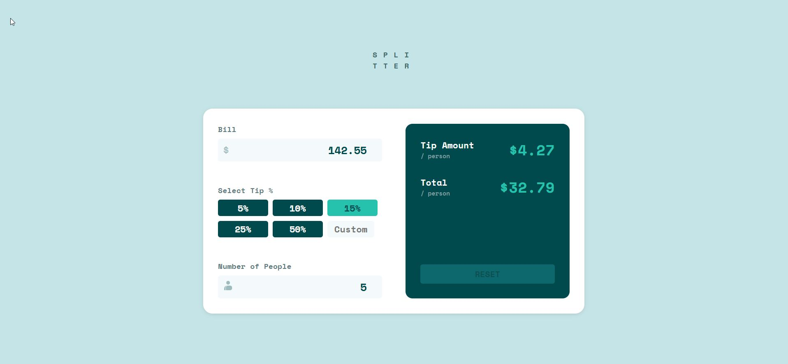

# Frontend Mentor - Tip calculator app solution

This is a solution to the [Tip calculator app challenge on Frontend Mentor](https://www.frontendmentor.io/challenges/tip-calculator-app-ugJNGbJUX). Frontend Mentor challenges help you improve your coding skills by building realistic projects.

## Table of contents

- [Overview](#overview)
  - [The challenge](#the-challenge)
  - [Screenshot](#screenshot)
  - [Links](#links)
- [My process](#my-process)
  - [Built with](#built-with)
  - [What I learned](#what-i-learned)
  - [Continued development](#continued-development)
  - [Useful resources](#useful-resources)
  - [AI Collaboration](#ai-collaboration)
- [Author](#author)
- [Acknowledgments](#acknowledgments)

**Note: Delete this note and update the table of contents based on what sections you keep.**

## Overview

### The challenge

Users should be able to:

- View the optimal layout for the app depending on their device's screen size
- See hover states for all interactive elements on the page
- Calculate the correct tip and total cost of the bill per person

### Screenshot

### Links

- Solution URL: https://github.com/naveen-developer/fm-project17
- Live Site URL: https://naveen-developer.github.io/fm-project17/

## My process

### Built with

- Semantic HTML5 markup
- CSS custom properties
- Flexbox
- CSS Grid
- Mobile-first workflow

### What I learned

### What I learned

### What I learned

While building this project, I learned how to handle multiple input fields using a single event listener function. Instead of creating separate functions for each input, I used the event object to identify which input triggered the event and update the calculations accordingly.

I also improved my understanding of DOM manipulation, form validation, and JavaScript functions. Additionally, I gained more experience creating responsive layouts with CSS and ensuring the tip calculations update correctly based on user input.

### Continued development

In future projects, I would like to continue improving my JavaScript skills, especially in areas such as form validation, event handling, and writing more reusable functions. I also want to focus on improving code organization and learning more advanced JavaScript concepts to build interactive applications more efficiently.

Additionally, I plan to spend more time matching designs more accurately to Figma specifications and improving my responsive design skills.

### Useful resources

* [MDN Web Docs](https://developer.mozilla.org/) - My primary resource for understanding JavaScript, HTML, and CSS concepts.
* [Frontend Mentor](https://www.frontendmentor.io/) - Helped me practice real-world frontend development by working on realistic projects and comparing my solutions with other developers.

### AI Collaboration

I used ChatGPT during this project to clarify JavaScript concepts, debug issues, and understand better approaches for handling events and calculations. It was particularly helpful when learning how to handle multiple input fields with a single event listener and improving the overall code structure.

The AI helped explain concepts and provide guidance, while I implemented and tested the solutions myself to better understand the logic behind the application.

## Author

* Name - Naveen
* Frontend Mentor - [@naveen-developer](https://www.frontendmentor.io/profile/yourusername)
* GitHub - [https://github.com/naveen-developer]

## Acknowledgments

Thanks to the Frontend Mentor community for providing the challenge and learning resources. Special thanks to ChatGPT for helping me understand JavaScript concepts, debugging techniques, and best practices while building this project.
